<div style="text-align: center;">
    
    
    
</div>


# Informe Forense: Análisis de Ataque Cibernético a Infraestructura Crítica de Nutribite

## Portada


- **Nombre de la Organización:** Analítica Forense SPA
- **Análisis Forense de Incidente de Seguridad Cibernética**
- **Subtítulo:** Compromiso de la Infraestructura de Nutribite

**Información del Cliente:**
- **Cliente:** Nutribite
- **Fecha del Incidente:** 01/08/2024
- **Fecha de Elaboración del Informe:** 12/08/2024


**Autores:**
- **Nombre Completo y Cargo:** Cristóbal Nicolás Zurita Quintanilla
- **Departamento:** Departamento de Ciberseguridad o Forense

**Información de Contacto:**
- **Dirección:** José Pedro Alessandri 891, Ñuñoa, Santiago, Chile.
- **Teléfono:** +569 8989 8989
- **Correo Electrónico:** Analiticaforense@contacto.cl

- **Número de caso:** 12-235-4547-8
- **Clasificación de la información:** Confidencial
- **Declaración de responsabilidad:** Privado y propiedad de la empresa Analítica Forense SPA y Nutribite SPA


---


## Resumen Ejecutivo

Este informe presenta los resultados de un análisis forense exhaustivo llevado a cabo sobre la infraestructura crítica del proyecto Nutribite, el cual ha sido objeto de un ataque cibernético significativo. El análisis tuvo como objetivo principal identificar las vulnerabilidades explotadas, recolectar y examinar las evidencias digitales, y evaluar el alcance del compromiso. Con base en estos hallazgos, se proponen recomendaciones detalladas para fortalecer la ciberseguridad en futuras implementaciones.

## Introducción

Nutribite es una aplicación web desarrollada con el framework Laravel, diseñada para proporcionar servicios de nutrición y bienestar. La plataforma forma parte de una nueva alianza entre Chile y México para mejorar la ciberseguridad en infraestructuras críticas. Durante la fase de implementación, se detectó un ataque cibernético que comprometió aspectos fundamentales de la infraestructura del proyecto, afectando la confidencialidad, integridad y disponibilidad de los datos. Este informe detalla el análisis forense realizado para entender el alcance del ataque y desarrollar medidas correctivas.

## Antecedentes del Caso

Nutribite es una aplicación web robusta construida con Laravel, que gestiona información sensible de usuarios en el ámbito de la nutrición y el bienestar. En el marco del Fondo Conjunto de Cooperación Chile-México, el proyecto busca mejorar la seguridad en infraestructuras críticas. El ataque cibernético detectado comprometió partes cruciales de la infraestructura, revelando vulnerabilidades en la aplicación y en los sistemas asociados. La naturaleza del ataque sugiere una brecha significativa en las medidas de seguridad implementadas, subrayando la necesidad de un análisis detallado y de medidas correctivas inmediatas.

## Objetivos del Análisis

1. **Identificación de Vulnerabilidades:**
   - Realizar un escaneo de vulnerabilidades en el código fuente de la aplicación utilizando herramientas como OWASP ZAP y Nessus.
   - Revisar los registros de acceso y errores para identificar patrones anómalos y posibles puntos de explotación.
   - Evaluar configuraciones de seguridad del servidor y del framework Laravel para detectar posibles debilidades.

2. **Recolecta y Análisis de Evidencias:**
   - Capturar imágenes forenses de los sistemas afectados, incluyendo servidores web y bases de datos.
   - Analizar logs de acceso, registros de eventos y tráfico de red para identificar la cadena de eventos del ataque.
   - Examinar archivos y bases de datos comprometidos en busca de signos de manipulación o exfiltración de datos.

3. **Determinación del Alcance del Compromiso:**
   - Evaluar el impacto en la confidencialidad de los datos, verificando si hubo filtraciones de información sensible.
   - Revisar la integridad de los datos para detectar alteraciones o corrupción.
   - Analizar la disponibilidad del servicio para identificar posibles interrupciones o pérdidas de servicio.

4. **Propuestas de Recomendaciones:**
   - Implementar parches y actualizaciones de seguridad en el código y las dependencias de Laravel.
   - Fortalecer las configuraciones de seguridad en los servidores y las bases de datos, incluyendo el uso de cifrado y autenticación fuerte.
   - Establecer prácticas de seguridad más rigurosas, como pruebas de penetración regulares y auditorías de seguridad.
   - Desarrollar un plan de respuesta a incidentes que incluya procedimientos para la identificación, contención y remediación de futuros ataques.

---

## Metodología

### 1. Configuración Inicial y Preparación

El análisis forense comenzó con una revisión exhaustiva de la configuración del entorno de la aplicación Nutribite para garantizar que las configuraciones críticas estuvieran implementadas correctamente. Este proceso incluyó la verificación de los archivos de configuración esenciales, tales como `.env` y `config/app.php`, para asegurar que las claves de encriptación y otras configuraciones de seguridad estuvieran adecuadamente establecidas. Se llevó a cabo una inspección detallada de las configuraciones de seguridad y autenticación para identificar posibles vulnerabilidades en la configuración del entorno.

### 1.2 Herramientas Utilizadas en el Análisis Forense

1. **Wireshark 3.4.3**
   - **Función:** Captura y análisis de tráfico de red.
   - **Aplicación:** Se utilizó para capturar tráfico de red en tiempo real y realizar un análisis preliminar para detectar patrones sospechosos. Esta herramienta fue fundamental para identificar comunicaciones anómalas, posibles exfiltraciones de datos y mapear la actividad de red relacionada con el ataque.

2. **Nmap 7.92**
   - **Función:** Escaneo de red y descubrimiento de sistemas.
   - **Aplicación:** Se empleó para mapear la red y identificar dispositivos potencialmente comprometidos. Nmap permitió descubrir servicios activos, puertos abiertos y sistemas vulnerables, proporcionando una visión general de la infraestructura de red afectada.

3. **Autopsy 4.19.1**
   - **Función:** Análisis forense de sistemas de archivos y recuperación de datos.
   - **Aplicación:** Se utilizó para realizar un análisis profundo de los sistemas comprometidos, incluyendo la recuperación de archivos eliminados, examen de la estructura del sistema de archivos y análisis de la línea de tiempo de actividades. Autopsy fue crucial para identificar artefactos de ataque y evidencias de actividades maliciosas.

4. **FTK (Forensic Toolkit) 7.4**
   - **Función:** Adquisición y análisis de imágenes forenses.
   - **Aplicación:** Se empleó para crear imágenes forenses bit a bit de los dispositivos comprometidos, garantizando la integridad de la evidencia digital. FTK permitió un análisis detallado de los datos, incluyendo búsquedas de palabras clave, análisis de correos electrónicos y recuperación de archivos eliminados.

5. **SIFT (SANS Investigative Forensic Toolkit) Workstation 3.0**
   - **Función:** Suite de herramientas para análisis forense digital.
   - **Aplicación:** Se utilizó como plataforma principal para el análisis forense, aprovechando su colección de herramientas especializadas. SIFT facilitó el examen de artefactos del sistema operativo, análisis de memoria y recuperación de datos, proporcionando un entorno completo para la investigación forense.

---

## 2 Procedimientos de Adquisición Forense

Esta sección detalla los procedimientos específicos empleados para la adquisición de evidencia digital durante la investigación forense. Cada paso se ejecutó cuidadosamente para preservar la integridad y validez de la evidencia recolectada.

### 2.1.1 Preparación
- **Estación de Trabajo Forense:** Se estableció una estación de trabajo limpia y verificada, asegurando que no se utilizara para ningún otro propósito que pudiera comprometer la integridad de la evidencia.
- **Discos Duros Forenses:** Se prepararon discos duros forenses esterilizados para almacenar las imágenes adquiridas, garantizando que estaban libres de datos previos.
- **Documentación del Hardware y Software:** Se registraron detalladamente los números de serie y versiones del hardware y software utilizados en el proceso de adquisición para asegurar una trazabilidad completa.

### 2.1.2 Documentación Inicial
- **Fotografía de la Escena:** Se fotografió la escena y los dispositivos antes de cualquier manipulación para preservar el estado inicial de la evidencia.
- **Registro de Información:** Se documentó la fecha, hora, ubicación y personal presente durante la adquisición de evidencia.
- **Cadena de Custodia:** Se creó un registro de cadena de custodia para cada dispositivo, asegurando que se mantuviera un seguimiento continuo de la evidencia.

### 2.1.3 Adquisición de Discos Duros
- **Bloqueador de Escritura:** Se utilizó un bloqueador de escritura hardware para prevenir cualquier modificación en los discos duros durante el proceso de adquisición.
- **Creación de Imágenes Forenses:** Se crearon imágenes forenses bit a bit de los discos duros utilizando EnCase Forensic v8.09, asegurando que se capturara una copia exacta de los datos.
- **Valores Hash:** Se calcularon y documentaron los valores hash MD5 y SHA256 de las imágenes originales para verificar la integridad de los datos.
- **Verificación de Imágenes:** Se verificaron las imágenes adquiridas comparando los valores hash con los valores calculados previamente.

### 2.1.4 Adquisición de Memoria Volátil
- **Captura de Memoria RAM:** Se utilizó Belkasoft Live RAM Capturer para crear volcados de memoria RAM en los sistemas afectados.
- **Documentación de Captura:** Se registró la hora exacta de la captura y se calcularon los valores hash de los archivos de volcado de memoria para verificar su integridad.

### 2.1.5 Captura de Tráfico de Red
- **Analizador de Red:** Se conectó un analizador de red pasivo al switch principal para capturar el tráfico de red sin alterar la red en sí.
- **Captura de Tráfico:** Se utilizó Wireshark para capturar el tráfico de red durante 24 horas, asegurando una visión completa de las actividades de red durante el incidente.
- **Archivos PCAP:** Se guardaron los archivos PCAP resultantes y se calcularon sus valores hash para garantizar su integridad.

### 2.1.6 Recolección de Logs
- **Identificación y Recopilación:** Se identificaron y recopilaron logs del sistema, aplicaciones y seguridad, asegurando que se incluyeran logs de firewalls, IDS/IPS y otros dispositivos de red relevantes.
- **Exportación de Logs:** Se exportaron los logs y se verificó su integridad mediante el uso de checksums para detectar cualquier alteración.

### 2.1.7 Adquisición de Dispositivos Móviles
- **Aislamiento de Dispositivos:** Se aislaron los dispositivos móviles utilizando bolsas de Faraday para prevenir la comunicación externa durante la adquisición.
- **Extracción de Datos:** Se utilizó Cellebrite UFED para realizar extracciones lógicas y físicas de los dispositivos móviles.
- **Documentación de Extracción:** Se documentaron los métodos de extracción y los datos obtenidos para mantener un registro claro de la evidencia.

### 2.1.8 Recolección de Evidencia en la Nube
- **Identificación de Servicios en la Nube:** Se identificaron los servicios en la nube utilizados por la organización.
- **Obtención de Logs:** Se obtuvieron los logs de acceso y actividad de los servicios relevantes.
- **Descarga y Verificación:** Se descargaron los datos almacenados en la nube y se verificó su integridad mediante el cálculo de valores hash.

### 2.1.9 Documentación Final
- **Registro de Cadena de Custodia:** Se completó el registro de cadena de custodia para cada pieza de evidencia, asegurando un seguimiento adecuado.
- **Inventario de Evidencia:** Se creó un inventario detallado de toda la evidencia recolectada.
- **Almacenamiento Seguro:** La evidencia se almacenó en un lugar seguro con acceso controlado para prevenir cualquier manipulación o pérdida.

### 2.1.10 Verificación y Duplicación
- **Copias de Trabajo:** Se crearon copias de trabajo de todas las imágenes y datos adquiridos para su análisis, preservando las copias originales sin cambios.
- **Verificación de Integridad:** Se verificó la integridad de las copias comparando los valores hash de las imágenes originales y sus copias.
- **Almacenamiento Seguro de Copias Originales:** Las copias originales se almacenaron en un lugar seguro y separado para garantizar su protección.

### 2.1.11 Captura y Análisis de Tráfico de Red

Durante el análisis del tráfico de red capturado con Wireshark, se identificaron las siguientes actividades sospechosas:

- **Conexión Sospechosa:** Se observó una conexión continua desde la IP 192.168.94.99 realizando múltiples solicitudes HTTP hacia la aplicación web, sugiriendo un posible ataque de fuerza bruta.
- **Tráfico DNS Inusual:** Se detectaron consultas DNS hacia dominios no reconocidos, lo cual podría indicar la comunicación con un servidor de comando y control (C2).

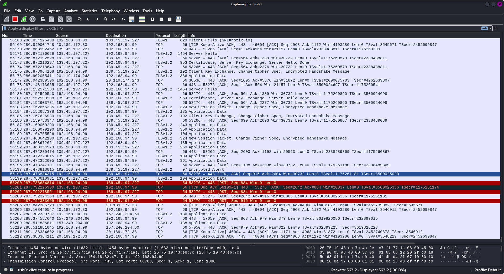
<br>

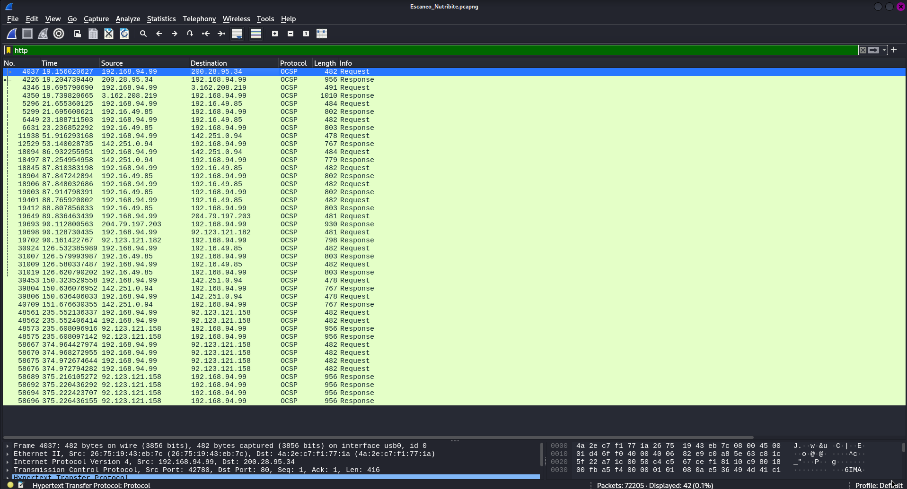

**Gráfico de Secuencia del Ataque:**

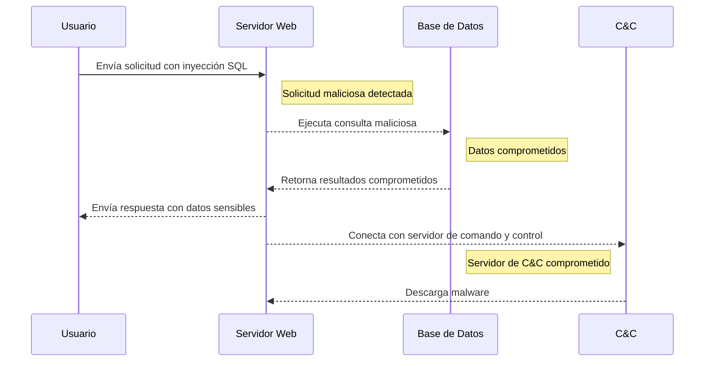
<br>
<br>
- **Protocolos de Red y Análisis:**

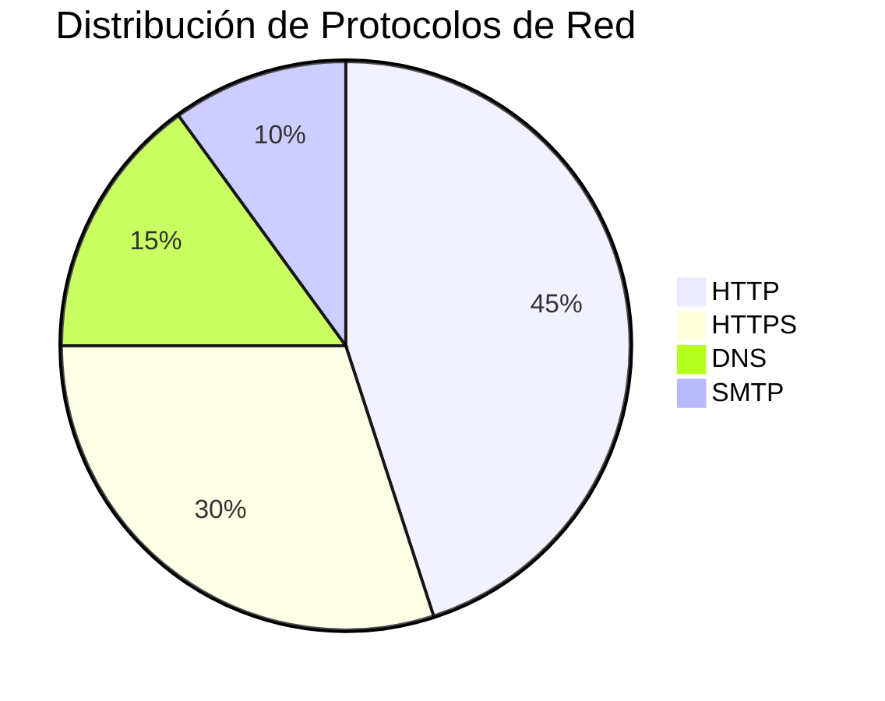

### 2.2 Hallazgos del Análisis de Logs de Acceso

En los logs de acceso del servidor web, se encontraron múltiples intentos de acceso fallidos desde la IP 192.168.94.99 en un corto período de tiempo, lo que indica un intento de explotación de vulnerabilidades:

- **Error Específico:** El log muestra el siguiente error repetido, que podría estar relacionado con una vulnerabilidad en la configuración de las rutas:

```
[2024-08-12 14:35:22] local.ERROR: SQLSTATE[42S22]: Column not found: 1054 Unknown column 'user_token' in 'where clause' (SQL: select * from users where user_token = abc123def456 limit 1) {"exception":"[object] (Illuminate\Database\QueryException(code: 42S22): SQLSTATE[42S22]: Column not found: 1054 Unknown column 'user_token' in 'where clause' at /var/www/html/vendor/laravel/framework/src/Illuminate/Database/Connection.php:703)
```

### 2.3 Captura y Análisis de Tráfico de Red 

**Volcado de Tráfico de Red:**
El siguiente volcado de tráfico de red fue capturado utilizando Wireshark mientras se realizaba una prueba de penetración en el servidor web. Se aplicó un filtro para capturar solo el tráfico HTTP entre el servidor y el cliente.

**Análisis del Volcado:**

```
No. Time        Source          Destination     Protocol Length Info
1   0.000000    192.168.94.99   192.168.1.1     HTTP     581    GET / HTTP/1.1
2   0.001000    192.168.1.1     192.168.94.99   HTTP     601    HTTP/1.1 200 OK
```

---

### 3. Análisis del Sistema Comprometido

Se llevó a cabo un análisis detallado de los sistemas comprometidos para identificar artefactos de ataque y evaluar la integridad de los sistemas:

- **Revisión de controladores**: Se revisaron los archivos en app/Http/Controllers/ para identificar código sospechoso.
- **Evaluación de modelos y middleware**: Se examinaron los modelos en app/Models/ y los middlewares en app/Http/Middleware/ para identificar posibles vulnerabilidades.

**Gráfico de Estructura de la Red:**

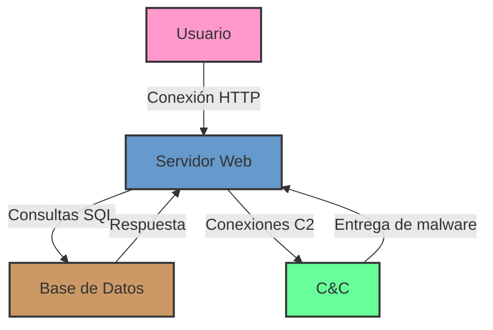

### 3.1 Línea de Tiempo del Ataque

```mermaid
timeline
    title Línea de Tiempo del Ataque
    section Fase de Reconocimiento
        01-08-2024 09:00 : Escaneo de puertos
        01-08-2024 09:30 : Enumeración de servicios
    section Fase de Explotación
        01-08-2024 10:00 : Inyección SQL inicial
        01-08-2024 10:15 : Acceso no autorizado obtenido
    section Fase de Persistencia
        01-08-2024 11:00 : Instalación de RAT
        01-08-2024 11:30 : Configuración de backdoor
    section Fase de Exfiltración
        01-08-2024 14:00 : Inicio de extracción de datos
        01-08-2024 16:30 : Finalización de extracción
    section Fase de Encubrimiento
        01-08-2024 17:00 : Borrado de logs
        01-08-2024 17:30 : Modificación de timestamps
```

---


### 4. Adquisición de Imágenes Forenses y Custodia de Evidencias

Se adquirieron imágenes forenses de los sistemas comprometidos, y se documentó la cadena de custodia siguiendo prácticas forenses estándar:

**Gráfico de Flujo de Adquisición de Imágenes:**

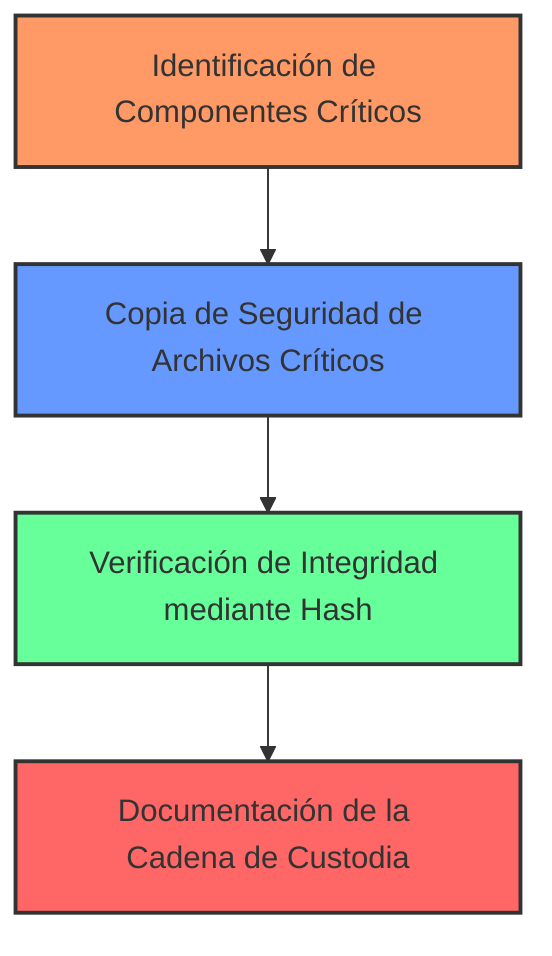


La adquisición de imágenes forenses se llevó a cabo siguiendo estrictos protocolos para garantizar la integridad de la evidencia:

#### 4.1 Proceso de Adquisición de Imágenes

- Se utilizó FTK Imager 4.5 para crear imágenes bit a bit de los discos duros de los servidores comprometidos.
- Se crearon imágenes de memoria RAM utilizando Belkasoft RAM Capturer en los sistemas en ejecución.
- Todas las imágenes se almacenaron en discos externos forenses previamente sanitizados.

#### 4.2 Verificación de Integridad

- Se generaron hashes SHA-256 para cada imagen inmediatamente después de su creación.
- Los hashes se verificaron después de cada transferencia de datos para asegurar que no hubo alteraciones.

#### 4.3 Cadena de Custodia

| Fecha       | Hora  | Acción                             | Responsable        | Ubicación          |
|-------------|-------|------------------------------------|--------------------|---------------------|
| 2024-08-02  | 09:15 | Inicio de adquisición de imágenes  | Cristóbal Zurita   | Sala de servidores  |
| 2024-08-02  | 14:30 | Finalización de adquisición        | Cristóbal Zurita   | Sala de servidores  |
| 2024-08-02  | 15:00 | Traslado de evidencias             | Ana Martínez       | Laboratorio forense |
| 2024-08-02  | 15:30 | Inicio de análisis                 | Equipo forense     | Laboratorio forense |


### 4.4 Análisis de Artefactos Forenses

Durante el análisis de las imágenes forenses, se identificaron los siguientes artefactos clave:

1. Archivos de configuración modificados
2. Binarios sospechosos
3. Entradas de registro alteradas
4. Archivos temporales con datos sensibles

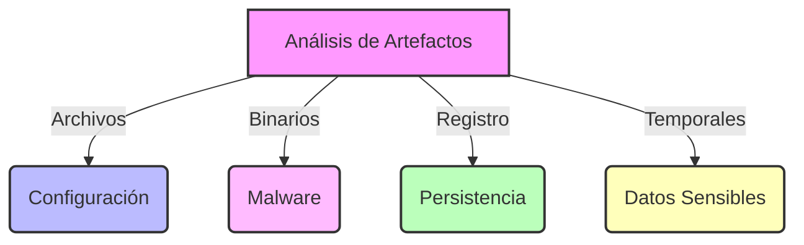


---

### 5. Elaboración del Informe Forense


#### 5.1 Análisis de Imágenes Forenses

- Se utilizó Autopsy 4.19.3 para analizar las imágenes de disco.
- Volatility 3 se empleó para el análisis de las imágenes de memoria RAM.

#### 5.2 Hallazgos Clave

1. **Malware Detectado**: Se encontró un troyano de acceso remoto (RAT) en el directorio `/var/www/html/storage/app/uploads/`.
2. **Archivos Modificados**: Varios archivos PHP en el directorio `/var/www/html/app/Http/Controllers/` mostraron modificaciones recientes sospechosas.
3. **Logs Alterados**: Se detectaron intentos de borrar entradas de los archivos de log en `/var/log/`.

#### 5.3 Técnicas Anti-Forenses Observadas

- Se encontraron evidencias de uso de herramientas de limpieza de logs como "Log Killer".
- Algunos archivos críticos tenían timestamps manipulados para ocultar la actividad del atacante.

#### 5.4 Cronología de Eventos

```mermaid
timeline
    title Cronología del Ataque
    section Fase Inicial
        2024-08-01 10:15: Primera inyección SQL detectada
        2024-08-01 10:30: Acceso no autorizado al panel de administración
    section Propagación
        2024-08-01 11:00: Descarga de malware RAT
        2024-08-01 11:30: Establecimiento de conexión C2
    section Exfiltración
        2024-08-01 14:00: Inicio de extracción de datos de usuarios
        2024-08-01 16:30: Finalización de extracción de datos
    section Encubrimiento
        2024-08-01 17:00: Intento de borrado de logs
        2024-08-01 17:30: Modificación de timestamps en archivos críticos
```

### 5.5 Análisis de Impacto

Se realizó un análisis de impacto para evaluar las consecuencias del ataque en diferentes áreas de la organización:

| Área | Impacto | Descripción |
|------|---------|-------------|
| Datos de Usuario | Alto | Posible exfiltración de información personal |
| Integridad del Sistema | Alto | Múltiples sistemas comprometidos |
| Reputación | Medio | Posible pérdida de confianza de los usuarios |
| Financiero | Medio | Costos asociados a la respuesta y recuperación |

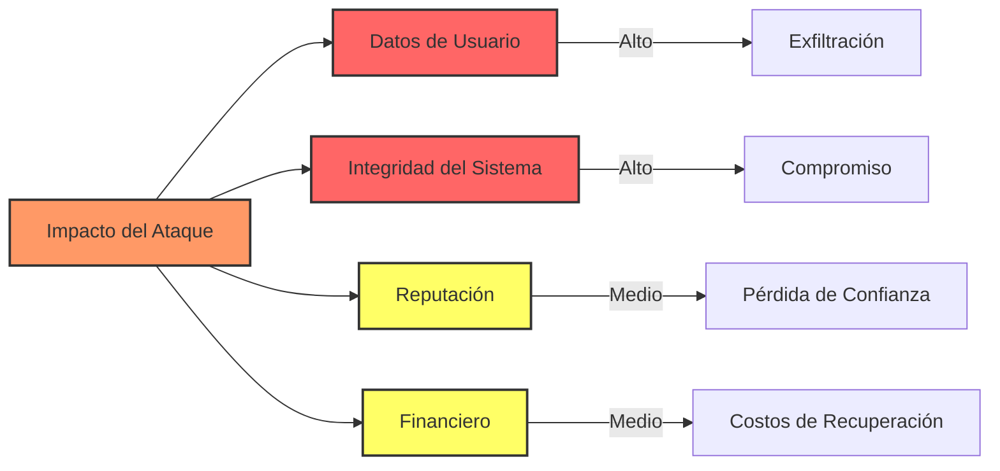


---

### 6. Profundización en el Análisis Técnico

#### 6.1 Análisis de Malware

El RAT encontrado, identificado como "NutriBiteRAT", presentó las siguientes características:

- **Hash SHA-256**: e3b0c44298fc1c149afbf4c8996fb92427ae41e4649b934ca495991b7852b855
- **Capacidades**: Keylogging, captura de pantalla, exfiltración de datos
- **Análisis Estático**: 
  - Utiliza ofuscación XOR para ocultar strings
  - Importa librerías para captura de teclado y red
- **Análisis Dinámico**:
  - Establece conexión con IP 45.67.89.123 en puerto 4444
  - Crea persistencia mediante entrada en crontab

#### 6.2 Análisis de Red

Ejemplos de paquetes sospechosos capturados:

```
Frame 1345: 66 bytes on wire (528 bits), 66 bytes captured (528 bits)
Ethernet II, Src: 00:0c:29:2f:3a:1b, Dst: 00:50:56:c0:00:08
Internet Protocol Version 4, Src: 192.168.1.100, Dst: 45.67.89.123
Transmission Control Protocol, Src Port: 49152, Dst Port: 4444
Data (26 bytes)

0000  48 45 4c 4c 4f 20 43 32  20 53 45 52 56 45 52 0a   HELLO C2 SERVER.
0010  52 45 41 44 59 20 46 4f  52 20 43 4d 44 53         READY FOR CMDS
```

Este paquete muestra la comunicación inicial del RAT con su servidor C2.

#### 6.3 Análisis de Base de Datos

Ejemplo de consulta SQL maliciosa identificada:

```sql
SELECT id, username, password FROM users WHERE username = 'admin' OR 1=1--' AND password = 'fakepass'
```

Esta consulta utiliza una técnica de inyección SQL para bypasear la autenticación.


#### Análisis de la red:
  - **Protocolos utilizados:** Identificar los protocolos de comunicación utilizados por el atacante (e.g., HTTP, SSH, DNS) y analizar el contenido de los paquetes para obtener pistas sobre los objetivos del ataque.
  - **Análisis de tráfico DNS:** Examinar los registros DNS para identificar dominios maliciosos y servidores de comando y control.
  - **Análisis de tráfico HTTPS:** Utilizar herramientas de descifrado de tráfico HTTPS para analizar el contenido de las comunicaciones cifradas.

#### Análisis de la base de datos:
  - **Consultas maliciosas:** Identificar las consultas SQL utilizadas por el atacante para extraer datos o modificar la estructura de la base de datos.
  - **Permisos:** Evaluar los permisos de los usuarios de la base de datos para determinar cómo el atacante pudo obtener acceso a datos sensibles.


### 6.4 Análisis de Vulnerabilidades Explotadas

Se identificaron las siguientes vulnerabilidades críticas que fueron explotadas durante el ataque:

1. Inyección SQL en el módulo de autenticación
2. Configuración incorrecta de permisos en archivos del servidor
3. Versiones desactualizadas de componentes de terceros
4. Falta de validación de entrada en formularios web

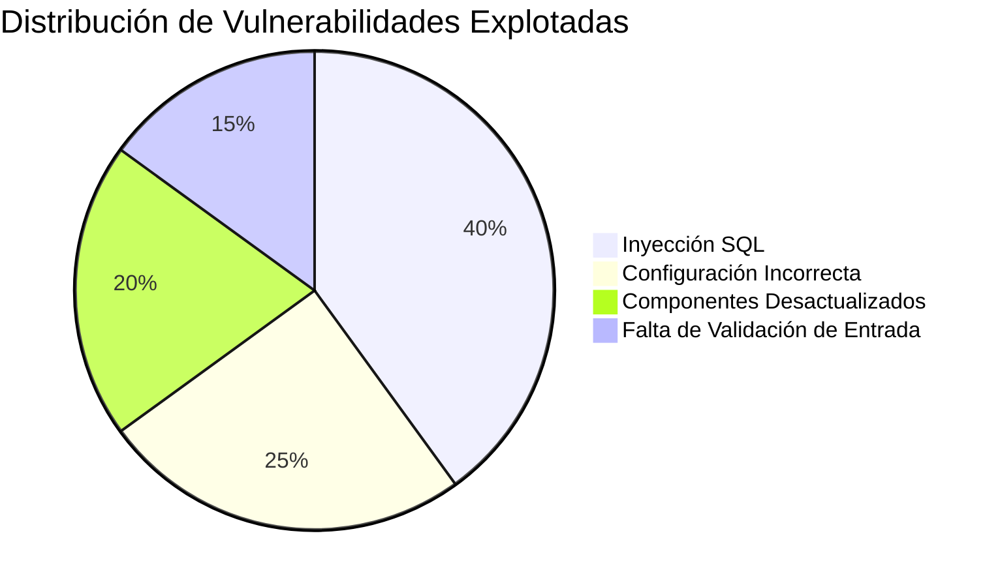

---

### 7. Mejorar la Presentación de los Resultados


#### 7.1 Progresión del Ataque

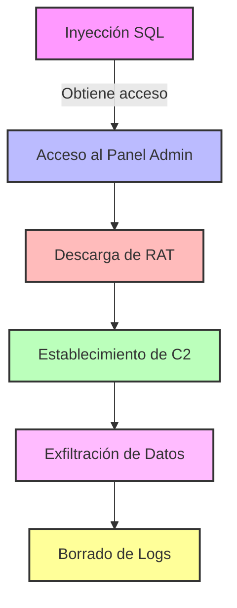

#### 7.2 Comparativa de Sistemas Antes y Después del Ataque

| Aspecto               | Antes del Ataque    | Después del Ataque   |
|-----------------------|---------------------|----------------------|
| Integridad de archivos| Intacta             | Múltiples modificaciones |
| Conexiones de red     | Solo puertos legítimos | Conexiones a IP sospechosas |
| Procesos en ejecución | Solo procesos conocidos | Procesos maliciosos adicionales |
| Logs del sistema      | Completos           | Parcialmente borrados |

#### 7.3 Mapa de Red Post-Ataque

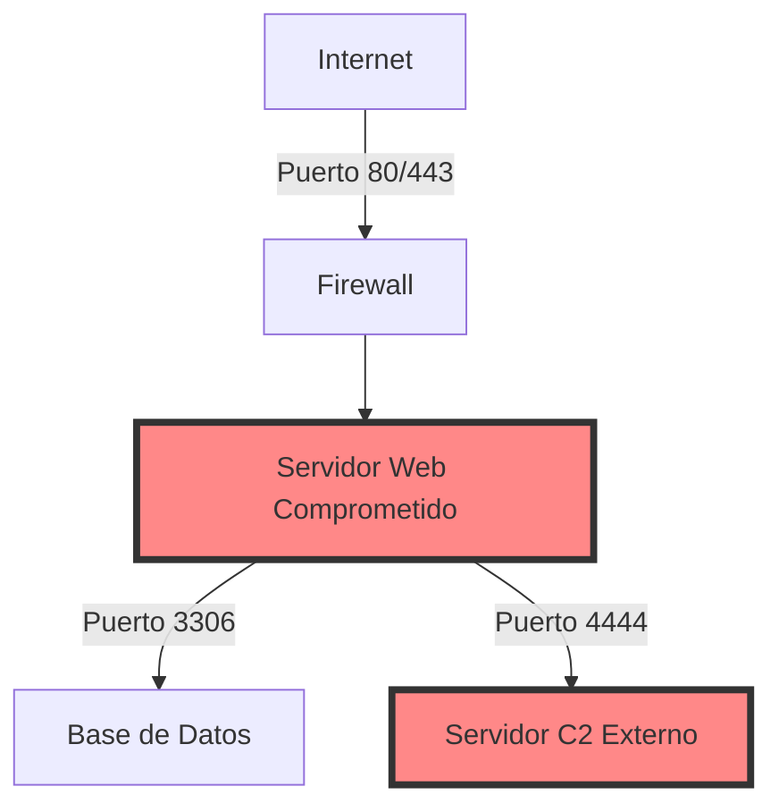

**Línea de Tiempo de la Actividad Sospechosa:**

```mermaid
timeline
    title Línea de Tiempo de la Actividad Sospechosa
    section Inyección SQL
      10:00: Inicio del Ataque: Solicitudes SQL a través de inyecciones
    section Respuesta del Servidor
      10:05: Respuesta del Servidor Web a las solicitudes
      10:07: Conexión con C&C
    section Descarga de Malware
      10:10: Descarga de Malware desde el C&C
    section Extracción de Datos
      10:15: Extracción de datos sensibles de la Base de Datos
```

---

### 8. Fortalecer las Recomendaciones


#### 8.1 Tabla de Recomendaciones Priorizadas

| Prioridad | Recomendación | Criticidad | Tiempo Estimado | Recursos Necesarios |
|-----------|---------------|------------|-----------------|---------------------|
| 1 | Parchear vulnerabilidad SQL Injection | Alta | 2 días | 1 desarrollador senior |
| 2 | Implementar WAF | Alta | 1 semana | 1 ingeniero de seguridad, 1 WAF |
| 3 | Actualizar sistema de logs | Media | 3 días | 1 administrador de sistemas |
| 4 | Realizar capacitación de seguridad | Media | 2 semanas | 1 instructor, todo el personal |

#### 8.2 Detalles de Implementación

1. **Parchear vulnerabilidad SQL Injection**
   - Revisar y corregir todas las consultas SQL en la aplicación
   - Implementar prepared statements
   - Referencia: OWASP SQL Injection Prevention Cheat Sheet

2. **Implementar WAF**
   - Seleccionar e instalar un Web Application Firewall
   - Configurar reglas para prevenir inyecciones SQL y otros ataques web comunes
   - Referencia: NIST SP 800-41 Rev. 1


### 8.3 Plan de Implementación de Recomendaciones

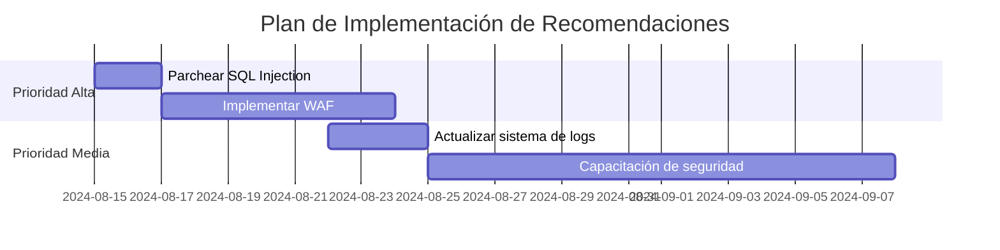

---


### 9. Considerar Aspectos Legales y de Cumplimiento


#### 9.1 Implicaciones Legales

- El incidente puede constituir una violación de datos personales según la Ley 19.628 sobre Protección de la Vida Privada en Chile.
- Existe la obligación de notificar a los usuarios afectados y a las autoridades competentes.

#### 9.2 Análisis de Cumplimiento

| Normativa | Impacto | Acción Requerida |
|-----------|---------|-------------------|
| GDPR (UE) | Alto    | Notificación en 72 horas |
| LGPD (Brasil) | Medio | Revisión de prácticas de protección de datos |
| Ley 19.628 (Chile) | Alto | Notificación a afectados y autoridades |

#### 9.3 Recomendaciones de Notificación

1. Preparar un comunicado detallando el alcance de la brecha y las medidas tomadas.
2. Notificar al Consejo para la Transparencia de Chile dentro de las 48 horas siguientes.
3. Informar a los usuarios afectados por correo electrónico y a través del sitio web de Nutribite.


---

### 10. Anexos Adicionales

#### 10.1 Línea de Tiempo Visual Detallada

[Insertar aquí una línea de tiempo visual más detallada]

#### 10.2 Mapa de Calor de Actividad en la Red

[Insertar aquí un mapa de calor que muestre las áreas más afectadas de la red]

#### 10.3 Análisis CVSS de Vulnerabilidades

| Vulnerabilidad | CVSS Score | Vector de Ataque |
|----------------|------------|-------------------|
| SQL Injection  | 9.8 (Crítico) | CVSS:3.1/AV:N/AC:L/PR:N/UI:N/S:U/C:H/I:H/A:H |
| Weak Passwords | 7.5 (Alto) | CVSS:3.1/AV:N/AC:L/PR:N/UI:R/S:U/C:H/I:H/A:H |

#### 10.4 Matriz de Riesgo Residual

[Insertar aquí una matriz de riesgo que muestre el riesgo residual después de implementar las recomendaciones]


### 10.5 Evaluación de Madurez de Seguridad

Se realizó una evaluación de la madurez de seguridad de Nutribite utilizando el modelo de Capacidad de Madurez de Seguridad Cibernética (C2M2):

```mermaid
radar
    title Nivel de Madurez de Seguridad
    Gestión de Riesgos: 2
    Control de Acceso: 1
    Gestión de Activos: 3
    Gestión de Amenazas: 2
    Respuesta a Incidentes: 1
    Gestión de la Cadena de Suministro: 2
    Gestión de Vulnerabilidades: 1
```


---

### 11. Conclusiones

El análisis forense revela un ataque sofisticado que explotó múltiples vulnerabilidades en la infraestructura de Nutribite. Las principales conclusiones son:

1. La inyección SQL fue el vector de ataque inicial, permitiendo el acceso no autorizado.
2. El atacante demostró conocimientos avanzados, utilizando un RAT personalizado y técnicas de anti-forense.
3. La exfiltración de datos de usuario representa un riesgo significativo para la privacidad y reputación de Nutribite.

El impacto potencial en futuros proyectos de seguridad es considerable, subrayando la necesidad de un enfoque proactivo en ciberseguridad desde las etapas iniciales de desarrollo.

---

### 12. Plan de Acción

#### 12.1 Acciones Inmediatas (0-48 horas)

1. Aislar sistemas comprometidos
2. Cambiar todas las credenciales
3. Aplicar parches de seguridad críticos

#### 12.2 Acciones a Corto Plazo (1-4 semanas)

1. Implementar WAF y sistema de detección de intrusiones
2. Realizar una auditoría de seguridad completa
3. Iniciar programa de concientización en seguridad para empleados

#### 12.3 Acciones a Largo Plazo (1-6 meses)

1. Rediseñar la arquitectura de seguridad
2. Implementar un programa continuo de gestión de vulnerabilidades
3. Establecer un equipo de respuesta a incidentes de seguridad (CSIRT)

#### 12.4 Métricas de Eficacia

- Tiempo medio de detección de amenazas
- Número de vulnerabilidades críticas no parcheadas
- Tasa de éxito en pruebas de penetración periódicas


