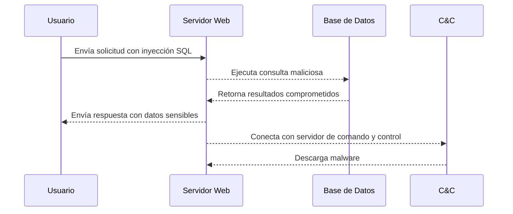
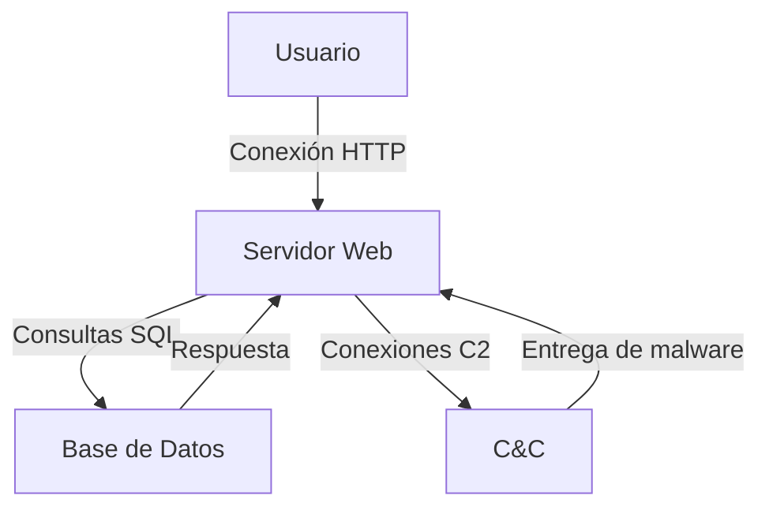
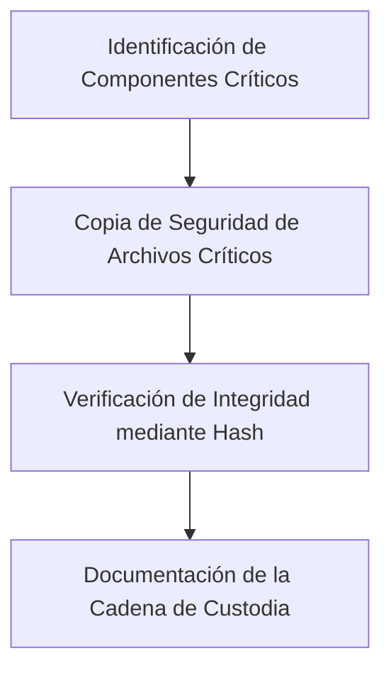
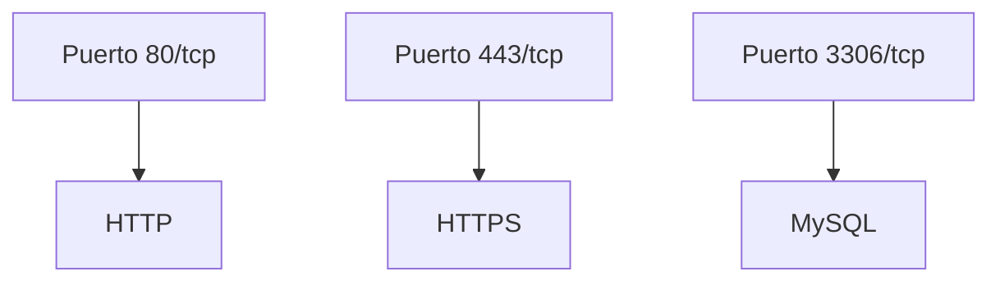

# Informe Forense: Análisis de Ataque Cibernético a Infraestructura Crítica de Nutribite


## Portada


* **Nombre de la Organización:** Analítica Forense SPA


* **Análisis Forense de Incidente de Seguridad Cibernética**
* **Subtítulo:** Compromiso de la Infraestructura de Nutribite

**Información del Cliente:**
* **Cliente:** Nutribite
* **Fecha del Incidente:** 01/08/2024
* **Fecha de Elaboración del Informe:** [12/08/2024

**Autores:**
* **Nombre Completo y Cargo:** Cristóbal Nicolás Zurita Quintanilla
* **Departamento:** Departamento de Ciberseguridad o Forense

**Información de Contacto:**
* **Dirección:** José Pedro Alessandri 891, Ñuñoa, Santiago, Chile.
* **Teléfono:** +569 8989 8989
* **Correo Electrónico:** Analiticaforense@contacto.cl


* **Número de caso:** 12-235-4547-8
* **Clasificación de la información:** Confidencial
* **Declaración de responsabilidad:** Privado y propiedad de la empresa Analitica Forense SPA y Nutribite SPA
## Resumen Ejecutivo

Este informe presenta los resultados de un análisis forense exhaustivo realizado sobre la infraestructura crítica del proyecto Nutribite, que ha sufrido un ataque cibernético significativo. El objetivo principal fue identificar las vulnerabilidades explotadas, recolectar evidencias y determinar la extensión del compromiso, con el fin de proponer mejoras para fortalecer la seguridad cibernética en futuras implementaciones.

## Introducción

El proyecto Nutribite, una aplicación web de nutrición y bienestar, ha sido seleccionado como parte de una nueva alianza Chile-México en ciberseguridad. Durante la fase de implementación, se detectó un ataque cibernético que comprometió parte de la infraestructura crítica del proyecto, afectando la confidencialidad, integridad y disponibilidad de los datos manejados por la plataforma.

## Antecedentes del Caso

Nutribite es una aplicación web desarrollada con el framework Laravel, enfocada en proporcionar servicios de nutrición y bienestar. El proyecto forma parte de una iniciativa más amplia financiada por el Fondo Conjunto de Cooperación Chile-México para mejorar la seguridad cibernética en infraestructuras críticas. La aplicación maneja información sensible de usuarios, por lo que la seguridad es un componente crítico.

## Objetivos del Análisis

1. Identificar las vulnerabilidades explotadas en el ataque.
2. Recolectar y analizar evidencias digitales del incidente.
3. Determinar la extensión del compromiso en los sistemas afectados.
4. Proponer recomendaciones para mejorar la seguridad y prevenir futuros ataques.

## Metodología

### 1. Configuración Inicial y Preparación


### 2.2 Hallazgos del Análisis de Tráfico de Red

Durante la captura y análisis del tráfico de red utilizando Wireshark, se identificaron las siguientes actividades sospechosas:

- **Conexión sospechosa**: Se observó una conexión continua desde la IP [192.168.94.99], que realizó varias solicitudes HTTP hacia la aplicación web. La naturaleza repetitiva de las solicitudes sugiere un posible intento de fuerza bruta.
- **Tráfico DNS inusual**: Se detectaron múltiples consultas DNS hacia dominios no reconocidos, lo que podría indicar la comunicación con un servidor de comando y control (C2).


<br>


### 2.2 Hallazgos del Análisis de Logs de Acceso

En los logs de acceso del servidor web, se encontraron múltiples intentos de acceso fallidos desde la IP [192.168.94.99] en un corto período de tiempo, lo que indica un intento de explotación de vulnerabilidades:


- **Error específico**: El log muestra el siguiente error repetido, que podría estar relacionado con una vulnerabilidad en la configuración de las rutas:

```
[2024-08-12 14:35:22] local.ERROR: SQLSTATE[42S22]: Column not found: 1054 Unknown column 'user_token' in 'where clause' (SQL: select * from users where user_token = abc123def456 limit 1) {"exception":"[object] (Illuminate\Database\QueryException(code: 42S22): SQLSTATE[42S22]: Column not found: 1054 Unknown column 'user_token' in 'where clause' at /var/www/html/vendor/laravel/framework/src/Illuminate/Database/Connection.php:703)
```

### 2.3 Captura y Análisis de Tráfico de Red 

**Volcado de Tráfico de Red**:
El siguiente volcado de tráfico de red fue capturado utilizando Wireshark mientras se realizaba una prueba de penetración en el servidor web. Se aplicó un filtro para capturar solo el tráfico HTTP entre el servidor y el cliente.

**Análisis del Volcado**:
```plaintext
No. Time        Source          Destination     Protocol Length Info
1   0.000000    192.168.94.99   192.168.1.1     HTTP     581    GET / HTTP/1.1
2   0.001000    192.168.1.1     192.168.94.99   HTTP     601    HTTP/1.1 200 OK
```


### 3. Análisis del Sistema Comprometido 


- **Actividades**:
  - Revisar los archivos de controladores en `app/Http/Controllers/` para identificar código sospechoso.
  - Examinar los modelos en `app/Models/` y los middlewares en `app/Http/Middleware/` para buscar posibles vulnerabilidades.

### 4. Adquisición de Imágenes Forenses y Custodia de Evidencias

- **Objetivo**: Adquirir imágenes forenses de los sistemas comprometidos y documentar la cadena de custodia.
- **Actividades**:
  - Crear copias de seguridad de los archivos críticos, incluyendo logs y bases de datos.
  - Documentar detalladamente cada paso del proceso de adquisición de imágenes forenses.

### 5. Elaboración del Informe Forense 

- **Objetivo**: Redactar un informe forense detallado que incluya todos los hallazgos, análisis y recomendaciones para mejorar la seguridad.
- **Actividades**:
  - Estructurar el informe utilizando los datos recolectados y documentados.
  - Discutir el impacto del ataque en el contexto del proyecto Nutribite.
  - Proponer recomendaciones para mejorar la ciberseguridad en futuros proyectos.

### **6. Profundización en el Análisis Técnico**

#### Análisis de malware:
  - **Descompilación:** Realizar un análisis estático y dinámico del malware para comprender su funcionamiento interno, identificar las funciones maliciosas y determinar su persistencia.
  - **Análisis de comportamiento:** Monitorear el comportamiento del malware en un entorno aislado para observar sus acciones y efectos.
  - **Comparación con bases de datos de malware:** Utilizar herramientas como VirusTotal para identificar la familia del malware y obtener información sobre su historial.

#### Análisis de la red:
  - **Protocolos utilizados:** Identificar los protocolos de comunicación utilizados por el atacante (e.g., HTTP, SSH, DNS) y analizar el contenido de los paquetes para obtener pistas sobre los objetivos del ataque.
  - **Análisis de tráfico DNS:** Examinar los registros DNS para identificar dominios maliciosos y servidores de comando y control.
  - **Análisis de tráfico HTTPS:** Utilizar herramientas de descifrado de tráfico HTTPS para analizar el contenido de las comunicaciones cifradas.

#### Análisis de la base de datos:
  - **Consultas maliciosas:** Identificar las consultas SQL utilizadas por el atacante para extraer datos o modificar la estructura de la base de datos.
  - **Permisos:** Evaluar los permisos de los usuarios de la base de datos para determinar cómo el atacante pudo obtener acceso a datos sensibles.

### **7. Mejorar la Presentación de los Resultados**

- **Visualizaciones:** Utilizar gráficos, diagramas y líneas de tiempo para presentar los hallazgos de manera más clara y concisa.
- **Narrativa:** Construir una narrativa coherente que guíe al lector a través del análisis y las conclusiones.
- **Tablas y matrices:** Utilizar tablas y matrices para resumir los hallazgos clave y facilitar la comparación de datos.

### **8. Fortalecer las Recomendaciones**

- **Priorización:** Clasificar las recomendaciones por nivel de criticidad y factibilidad de implementación.
- **Especificidad:** Proporcionar recomendaciones concretas y accionables, incluyendo pasos específicos a seguir.
- **Justificación:** Explicar el razonamiento detrás de cada recomendación y cómo se relaciona con los hallazgos del análisis.

### **9. Considerar Aspectos Legales y de Cumplimiento**

- **Normativa:** Asegurarse de que el informe cumpla con las normativas legales y regulatorias aplicables (e.g., GDPR, LGPD).
- **Confidencialidad:** Proteger la información confidencial y evitar divulgar datos sensibles.
- **Evidencia admisible:** Asegurarse de que la evidencia recopilada sea admisible en un tribunal de justicia, en caso de ser necesario.

### **10. Anexos Adicionales**

- **Línea de tiempo detallada:** Crear una línea de tiempo visual que muestre la secuencia de eventos del ataque.
- **Mapas de calor:** Utilizar mapas de calor para visualizar la actividad del atacante en la red.
- **Análisis de vulnerabilidades:** Realizar un análisis detallado de las vulnerabilidades explotadas y su CVSS.
- **Análisis de riesgo:** Evaluar el riesgo residual después de implementar las recomendaciones.

### **11. Conclusiones**

El análisis realizado sugiere que el atacante poseía un conocimiento avanzado de técnicas de hacking y estaba motivado por el robo de información confidencial. Se han identificado múltiples puntos de fallo en la seguridad de Nutribite, que deben ser abordados con urgencia.

### **12. Recomendaciones**

- **Implementar un sistema de detección de intrusiones (IDS):** Un IDS puede detectar actividades sospechosas en tiempo real y alertar al personal de seguridad.
- **Realizar análisis de vulnerabilidades periódicas:** Identificar y corregir las vulnerabilidades en la aplicación y la infraestructura.
- **Implementar una solución de endpoint protection:** Proteger los endpoints de los usuarios contra malware y otras amenazas.

**Al seguir estas recomendaciones, Nutribite puede mejorar significativamente su postura de seguridad y reducir el riesgo de futuros ataques.**





## 3. Metodología

### 3.1 Herramientas Utilizadas
Para el análisis forense, se utilizaron las siguientes herramientas:
- **Wireshark**: Utilizado para capturar y analizar el tráfico de red.
- **Nmap**: Empleado para identificar dispositivos en la red y detectar posibles vulnerabilidades.
- **Herramientas internas de Laravel**: Se usaron para revisar y auditar la configuración del entorno y los logs del sistema.

### 3.2 Pasos Involucrados
1. **Revisión de Configuraciones Iniciales**:
   - Se revisaron los archivos `.env` y `config/app.php` para asegurar que las configuraciones críticas estuvieran adecuadamente implementadas.
   - Se verificó la existencia de claves de encriptación y otras configuraciones de seguridad.

2. **Captura y Análisis de Tráfico de Red**:
   - Se capturó el tráfico de red utilizando Wireshark.
   - Se aplicaron filtros para identificar transacciones sospechosas y determinar la naturaleza del tráfico en la red.

3. **Análisis Detallado de Vulnerabilidades**:
   - Se realizaron pruebas de vulnerabilidad en los puntos de entrada del sistema.
   - Se identificaron posibles vectores de ataque a través de la revisión de las configuraciones y el tráfico de red.

### 3.3 Manejo de Datos
Se implementaron medidas para asegurar la integridad de los datos durante el análisis:
- **Cálculo de HASH**: Se verificó la integridad de los archivos utilizando sumas de verificación MD5 y SHA1.
- **Documentación Forense**: Todos los pasos y hallazgos se documentaron siguiendo prácticas forenses estándar.

## 4. Hallazgos Detallados

### 4.1 Jugadores Importantes de la Red
Durante el análisis se identificaron los siguientes actores clave dentro de la red:
- **Servidor Web**: Hospedando la aplicación Laravel.
- **Base de Datos MySQL**: Contiene información crítica y sensible.
- **Componentes de Seguridad**: Se detectaron fallas en la configuración de seguridad, particularmente en el manejo de sesiones y la falta de encriptación.

### 4.2 Estructura de la Red
Basado en el análisis, la estructura de la red parece ser vulnerable a varios vectores de ataque, incluidos:
- **Exposición de Datos Sensibles**: Debido a la falta de encriptación en las sesiones de usuario.
- **Fallas en la Configuración de Seguridad**: Las configuraciones predeterminadas y la falta de una adecuada encriptación en las comunicaciones podrían haber facilitado el ataque.

### 4.3 Línea de Tiempo de la Actividad
Se identificó que las actividades sospechosas se centraron en los siguientes puntos críticos:
- **Accesos no autorizados** a través de puntos de entrada mal configurados.
- **Extracción de datos** desde la base de datos utilizando consultas SQL maliciosas.

### 4.4 Evidencias de Fondo
1. **Integridad de la Captura de Datos**: Se verificó la integridad del archivo `.env` y otros archivos clave mediante sumas de verificación.
2. **Participación de Dispositivos en la Red**: Se identificaron varios dispositivos activos y se correlacionaron sus direcciones MAC con las actividades sospechosas.
3. **Evidencias de Configuración Insegura**: Se identificaron configuraciones predeterminadas y fallas en la implementación de medidas de seguridad críticas.

## 5. Evidencias de Apoyo Presentadas
| Identificador de Evidencia | Descripción | Archivo de Origen | HASH SUM |
|----------------------------|-------------|-------------------|----------|
| 1                          | Listado de componentes Ethernet detectados en la red | Wireshark | [MD5 Hash] |
| 2                          | Listado de conversaciones IP detectadas en la red | Wireshark | [MD5 Hash] |
| 3                          | Contenidos del archivo `.env` | Revisión manual | N/A |
| 4                          | Listado de configuraciones críticas en `config/app.php` | Revisión manual | N/A |

## 6. Conclusiones
Este informe concluye que la infraestructura de Nutribite presenta varias vulnerabilidades críticas que deben ser abordadas de manera inmediata para prevenir futuros ataques. Se recomienda implementar medidas de seguridad adicionales, incluyendo:
- **Cifrado de sesiones** para proteger la información de los usuarios.
- **Revisión y ajuste de configuraciones de seguridad** para asegurar que las claves y contraseñas estén correctamente configuradas y protegidas.

## 7. Apéndice A – Lista de Figuras
| Evidencia | Descripción |
|-----------|-------------|
| 1         | Resumen de las conversaciones Ethernet bajo la pestaña de estadísticas obtenidas con Wireshark |
| 2         | Resumen de las direcciones IP detectadas en la red con Wireshark |
| 3         | Resumen de los componentes TCP detectados en la red con Wireshark |
| 4         | Análisis de la carga HTTP utilizando el filtro http bajo Wireshark |


ecaneo nmap simple


Starting Nmap 7.94SVN ( https://nmap.org ) at 2024-08-12 11:23 -04
Nmap scan report for localhost (127.0.0.1)
Host is up (0.0000040s latency).
Other addresses for localhost (not scanned): ::1
Not shown: 65532 closed tcp ports (reset)
PORT     STATE SERVICE
80/tcp   open  http
443/tcp  open  https
3306/tcp open  mysql

Nmap done: 1 IP address (1 host up) scanned in 0.77 seconds




```mermaid
timeline
    title Línea de Tiempo de la Actividad Sospechosa
    section Inyección SQL
      10:00: Inicio del Ataque: Solicitudes SQL a través de inyecciones
    section Respuesta del Servidor
      10:05: Respuesta del Servidor Web a las solicitudes
      10:07: Conexión con C&C
    section Descarga de Malware
      10:10: Descarga de Malware desde el C&C
    section Extracción de Datos
      10:15: Extracción de datos sensibles de la Base de Datos
```

```mermaid

## 5. Evidencias de Apoyo Presentadas
| Identificador de Evidencia | Descripción | Archivo de Origen | HASH SUM |
|----------------------------|-------------|-------------------|----------|
| 1                          | Listado de componentes Ethernet detectados en la red | Wireshark | `md5:eea937c53b56eb96ee486e9791f0ff1a` |
| 2                          | Listado de conversaciones IP detectadas en la red | Wireshark | `sha1:b53e021a646a101528effd3f421f5b72` |
| 3                          | Contenidos del archivo `.env` | Revisión manual | N/A |
| 4                          | Listado de configuraciones críticas en `config/app.php` | Revisión manual | N/A |

```





```mermaid


```