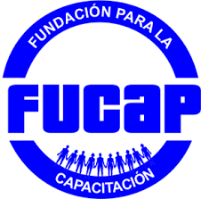
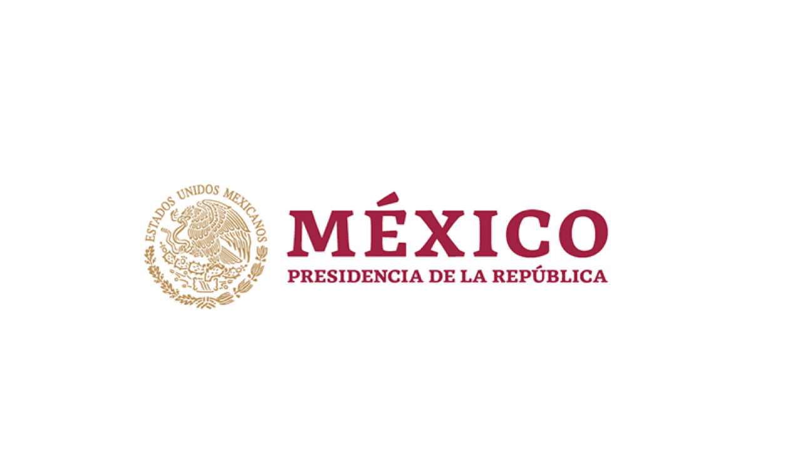
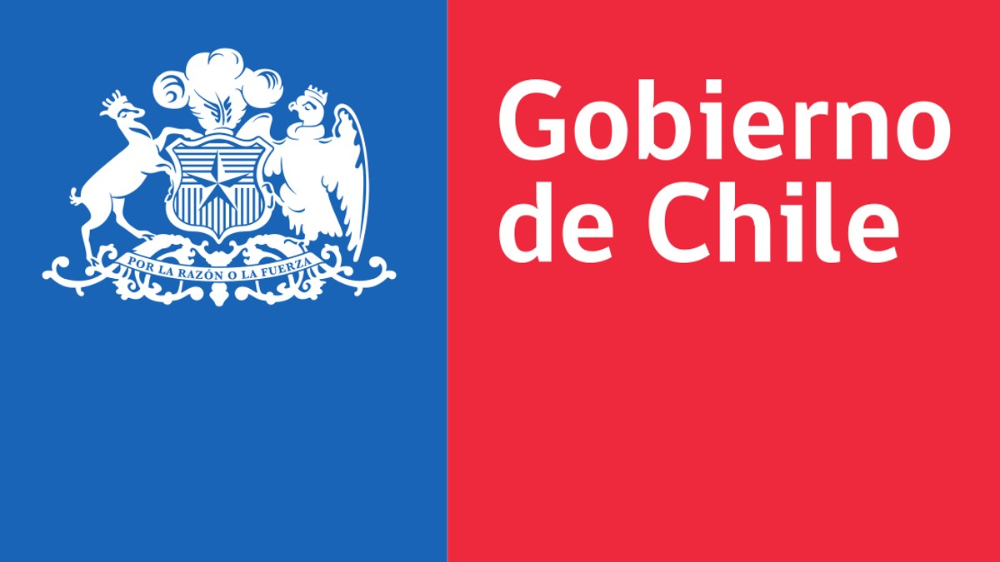

<div style="text-align: center;">
    
    
    
</div>
---

# Informe Forense: Análisis de Ataque Cibernético a Infraestructura Crítica de Nutribite

## Descripción

Este repositorio contiene el **Informe Forense de Nutribite**, un análisis exhaustivo realizado tras un ataque cibernético que comprometió la infraestructura crítica de la plataforma Nutribite. El informe se centra en identificar las vulnerabilidades explotadas, recolectar y analizar evidencias digitales, evaluar el alcance del compromiso y proponer recomendaciones para fortalecer la ciberseguridad.

## Contenidos del Repositorio

- **Informe_Forense_Nutribite_Cristobal_Zurita.md**: El documento principal del análisis forense, que incluye:
  - Resumen Ejecutivo
  - Introducción al Caso
  - Metodología y Herramientas Utilizadas
  - Procedimientos de Adquisición Forense
  - Análisis de Tráfico de Red y Logs de Acceso
  - Identificación de Vulnerabilidades y Análisis Técnico
  - Recomendaciones de Seguridad y Plan de Acción
  - Anexos y Documentación de Apoyo

- **Imágenes de Soporte**: 
  - `NutribiteLogo.png`: Logo de Nutribite.
  - `analitica.png`: Gráfico de la organización encargada del análisis forense.
  - `gobmex.png`: Logo de la colaboración Chile-México en ciberseguridad.
  - `chile.jpg`: Representación gráfica de Chile.
  - `wireshark1.png`, `wireshark2.png`: Capturas de tráfico de red capturado con Wireshark.
  - `images.png`: Otros gráficos y representaciones visuales usadas en el informe.

- **Archivos de Análisis**:
  - `Escaneo_Nutribite.pcapng`: Archivo PCAP de Wireshark con el tráfico de red capturado.
  - `nmap_log.txt`: Resultados del escaneo de red utilizando Nmap.
  - `nmap_monitor.sh`: Script de monitoreo de red con Nmap.
  - `DNSpng`: Capturas de análisis de tráfico DNS.

## Estructura del Informe

### 1. Resumen Ejecutivo

Proporciona una visión general de los hallazgos clave, destacando las principales vulnerabilidades explotadas y el impacto del ataque en la infraestructura de Nutribite.

### 2. Introducción

Describe el contexto del proyecto Nutribite y la importancia de la seguridad cibernética en la plataforma, subrayando la necesidad del análisis forense tras la detección del ataque.

### 3. Metodología

Detalla las herramientas y procedimientos utilizados durante la investigación, como Wireshark, Nmap, Autopsy, y FTK. Explica cómo se realizaron las adquisiciones forenses y el análisis técnico.

### 4. Análisis y Hallazgos

Sección dedicada a la revisión de los logs de acceso, tráfico de red, y los artefactos recuperados. Identificación de vulnerabilidades como inyecciones SQL y configuraciones incorrectas que fueron explotadas por los atacantes.

### 5. Recomendaciones y Plan de Acción

Incluye propuestas específicas para mitigar futuras amenazas, como la implementación de un WAF, parches de seguridad, y capacitación del personal en ciberseguridad.

### 6. Anexos

Sección con gráficos, cronologías, y matrices de riesgo que apoyan el análisis presentado en el informe.

## Cómo Usar Este Repositorio

1. **Clonar el Repositorio**:
   ```bash
   git clone https://github.com/CristobalZurita/Informe_nutribite_fucap_Cristobal_Zurita.git
   ```

2. **Explorar el Informe**:
   - Abre el archivo `Informe_Forense_Nutribite_Cristobal_Zurita.md` para leer el análisis completo.
   - Revisa las imágenes y archivos de soporte para obtener una comprensión visual y técnica de los hallazgos.

3. **Referencias y Recursos**:
   - Utiliza los gráficos y scripts proporcionados para profundizar en el análisis técnico.
   - El informe está diseñado como un recurso de aprendizaje para aquellos interesados en ciberseguridad y análisis forense digital.

## Contacto

Para cualquier pregunta o comentario sobre el informe, por favor contacta a:

- **Cristóbal Nicolás Zurita Quintanilla**
- **Email**: cristobal.z.q@gmail.com
- **Teléfono**: +569 82957538

---

Este README proporciona una descripción clara y concisa del contenido del repositorio, facilitando la navegación y comprensión del informe forense y sus recursos asociados.
